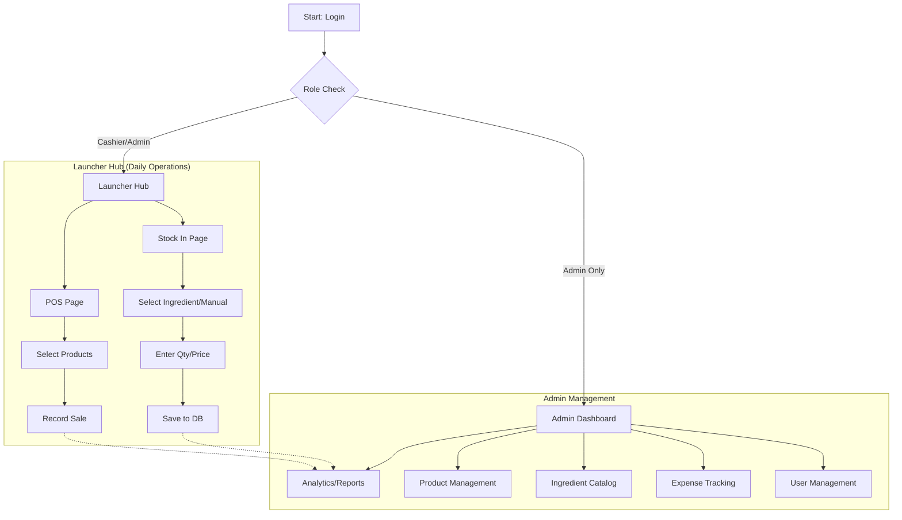

# 🍵 Think Cafe POS - Smart Management System

[](https://vitejs.dev/)
[](https://reactjs.org/)
[](https://supabase.io/)
[](https://tailwindcss.com/)

A modern, high-performance Point of Sale system designed specifically for cafe tablets. Built with speed, reliability, and ease of use in mind, featuring a robust catalog system and deep financial reporting.

---

## 🚀 Key Features

### 🛒 Tablet-Optimized POS
- **Seamless Sales**: Quick-tap product catalog for rapid order entry.
- **On-Screen Numpad**: Large, touch-friendly numeric input for quantities and custom prices.
- **Georgian Virtual Keyboard**: Native character input support for manual item names, eliminating the need for physical keyboards.

### 📦 Dynamic Inventory Management (Stock In)
- **Categorized Ingredients**: Group your stock items into logical categories (e.g., Vegetables, Dairy).
- **Smart Sorting**: Automatic **"Recently Used"** and **"Most Used"** sections for ultra-fast access to frequent items.
- **Draft Persistence**: Auto-saves your stock-in progress locally so you never lose data mid-task.
- **Manual Logging**: Log miscellaneous expenses directly into the system.

### 📊 Admin Analytics Dashboard
- **Financial Intelligence**: Real-time sales vs. purchases vs. profit tracking.
- **Ingredient Insights**: Detail breakdown of which ingredients were bought, how much, and at what price.
- **Time-based Filtering**: View reports by Today, Week, Month, or Custom range.
- **User Management**: Simple role-based control for Cashiers and Admins.

---

## 🗺️ User Flow



---

## 🛠️ Tech Stack

- **Frontend**: React + Vite (Typescript)
- **State Management**: Zustand
- **Database / Auth**: Supabase (PostgreSQL)
- **Styling**: Vanilla CSS + Utility classes
- **Icons**: Lucide React
- **Charts**: Recharts

---

## ⚙️ Setup & Installation

### Prerequisites
- Node.js (v18+)
- Supabase Project

### Quick Start
1. **Clone the repository**:
   ```bash
   git clone https://github.com/GYRAG/think-cafe-pos.git
   cd think-cafe-pos
   ```

2. **Install dependencies**:
   ```bash
   npm install
   ```

3. **Configure Environment Variables**:
   Create a `.env` file and add your Supabase credentials:
   ```env
   VITE_SUPABASE_URL=your_supabase_url
   VITE_SUPABASE_ANON_KEY=your_supabase_anon_key
   ```

4. **Run Locally**:
   ```bash
   npm run dev
   ```

5. **Build for Production**:
   ```bash
   npm run build
   ```

---

## 🌿 Design Language
- **Accent Color**: `#16a34a` (Safe Green)
- **Action Color**: `#dc2626` (Danger Red)
- **Background**: Soft Stone (`#f5f5f4`)
- **Typography**: Heavy Black headers with Medium sans-serif body text.

---

*Built with ❤️ for Cafe Owners.*
