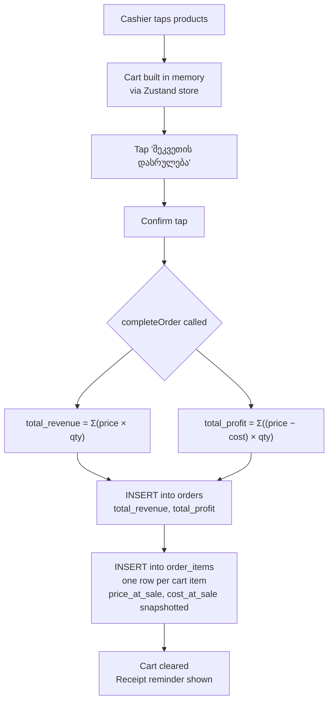
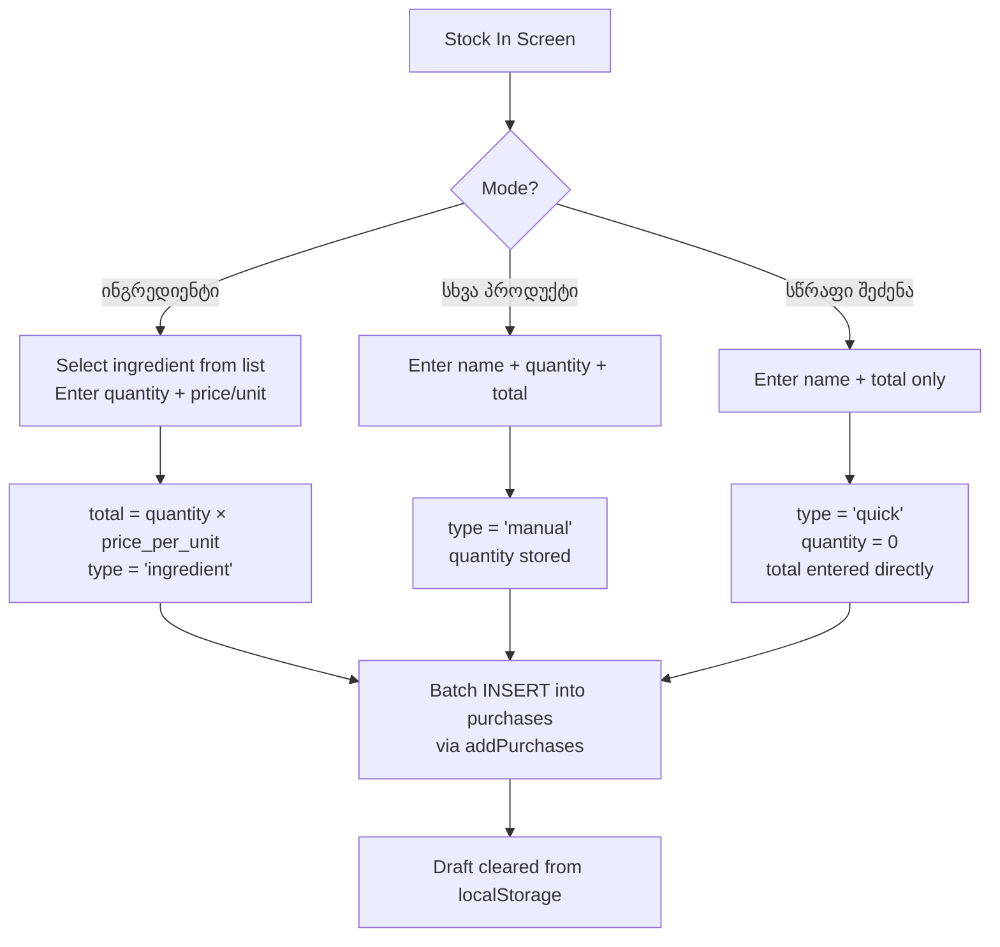
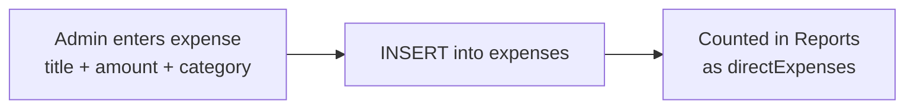
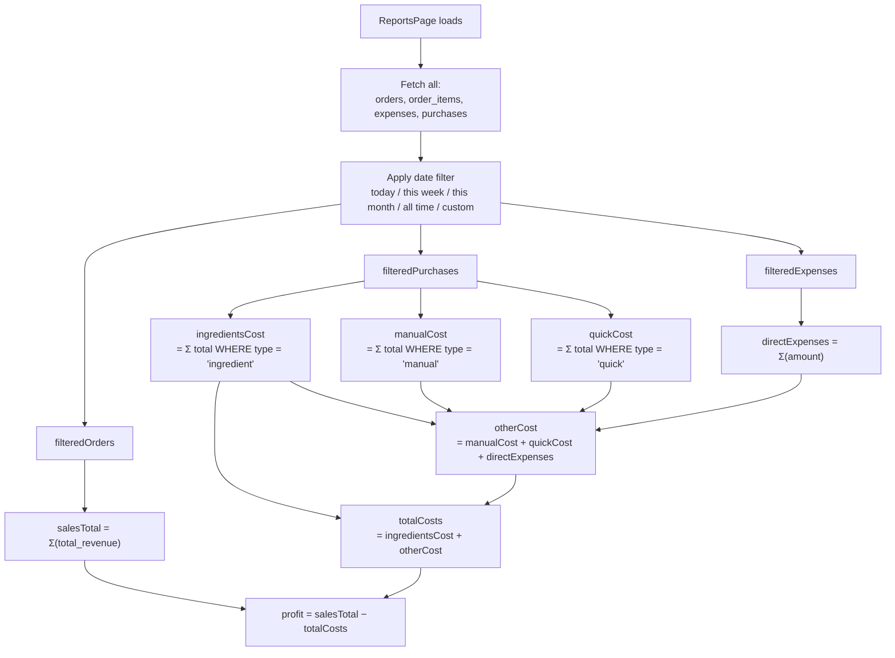
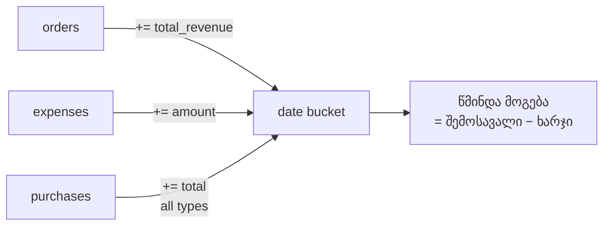
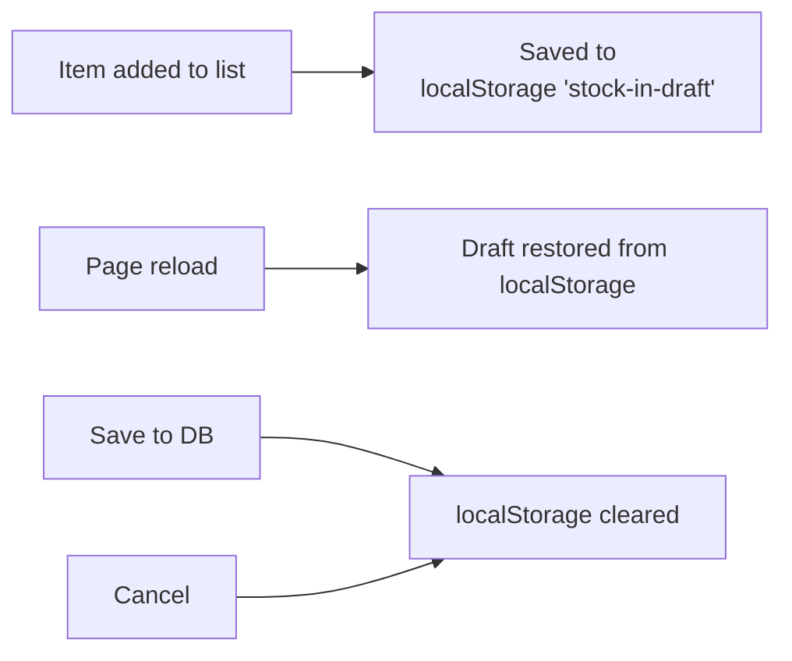

# Café POS — Backend Logic & Calculations

All data lives in **Supabase (PostgreSQL)**. The frontend reads/writes via the Supabase JS client in [`db.ts`](file:///c:/Users/kinkl/OneDrive/Desktop/web-projects/cafe-pos-system/src/lib/db.ts).

---

## Database Tables

| Table | Purpose |
|---|---|
| `products` | Menu items with `price` (sale price) and `cost` (ingredient cost) |
| `orders` | One row per completed sale session |
| `order_items` | Individual line items belonging to an order |
| `expenses` | Manual one-off expenses (rent, utilities, etc.) |
| `purchases` | Stock-in records (ingredient / manual / quick) |
| `ingredients` | Reference list of tracked ingredients |

---

## 1. Completing a Sale (POS Page)



### Formulas

```
total_revenue  = Σ ( product.price × quantity )
total_profit   = Σ ( (product.price − product.cost) × quantity )
```

> `price_at_sale` and `cost_at_sale` are **snapshotted at the moment of sale** so historical reports remain accurate even if product prices change later.

---

## 2. Stock In / Purchases

Three purchase types all write to the `purchases` table:



### Data stored per type

| Field | ingredient | manual | quick |
|---|---|---|---|
| `type` | `'ingredient'` | `'manual'` | `'quick'` |
| `name` | ingredient name | free text | free text |
| `quantity` | entered | entered | `0` |
| `unit` | from ingredient | — | — |
| `price_per_unit` | entered | — | — |
| `total` | qty × ppu | entered | entered |

---

## 3. Expenses

Direct expenses (rent, repairs, etc.) are separate from purchases:



---

## 4. Reports — How Everything Is Calculated



### Summary Card formulas

```
salesTotal       = Σ orders.total_revenue           (what customers paid)

ingredientsCost  = Σ purchases.total  [type='ingredient']
manualCost       = Σ purchases.total  [type='manual']
quickCost        = Σ purchases.total  [type='quick']
directExpenses   = Σ expenses.amount

otherCost        = manualCost + quickCost + directExpenses
totalCosts       = ingredientsCost + otherCost

profit           = salesTotal − totalCosts
```

### UI display in the Expenses card

| Label | Value |
|---|---|
| ინგრედიენტები | `ingredientsCost` |
| სხვა ხარჯები | `otherCost` (manual + quick + direct expenses) |
| **სულ** | `totalCosts` |

---

## 5. Chart Data (შემოსავალი და ხარჯი)

Each date bucket is built by combining all three data sources:



> Note: the chart's `ხარჯი` bar includes **all** purchases (ingredient + manual + quick) plus direct expenses.

---

## 6. Draft Persistence (Stock In)



Quick purchase recent names are also persisted separately under `'quick-recent-names'`.
