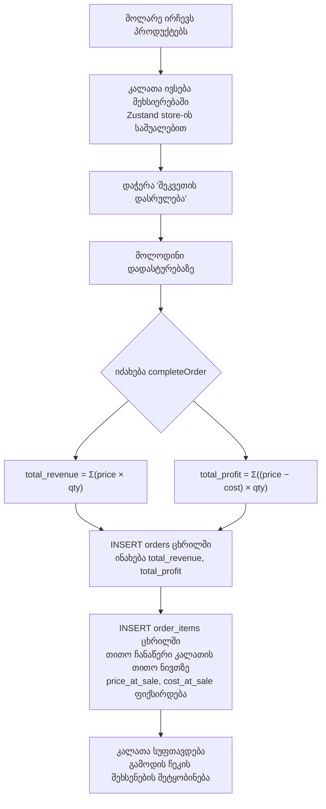
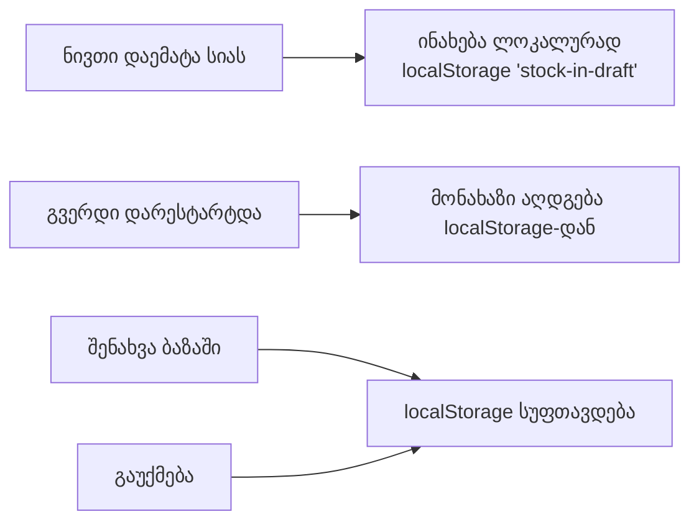

# კაფეს POS — Backend ლოგიკა და გამოთვლები

ყველა მონაცემი ინახება **Supabase (PostgreSQL)**-ში. Frontend-ი მონაცემებს კითხულობს და წერს Supabase JS კლიენტის საშუალებით, რომელიც მდებარეობს [`db.ts`](file:///c:/Users/kinkl/OneDrive/Desktop/web-projects/cafe-pos-system/src/lib/db.ts) ფაილში.

---

## მონაცემთა ბაზის ცხრილები (Tables)

| ცხრილი | დანიშნულება |
|---|---|
| `products` | მენიუს პროდუქტები `price` (გასაყიდი ფასი) და `cost` (თვითღირებულება/ინგრედიენტების ჯამური ფასი) ველებით |
| `orders` | ერთი ჩანაწერი თითოეულ დასრულებულ შეკვეთაზე (გაყიდვაზე) |
| `order_items` | შეკვეთის თითოეული პროდუქტი (ხაზი) |
| `expenses` | მექანიკურად/ხელით დამატებული ხარჯები (ქირა, კომუნალურები და ა.შ.) |
| `purchases` | მარაგების შევსების ისტორია (ინგრედიენტი / სხვა / სწრაფი) |
| `ingredients` | აღრიცხვაზე მყოფი ინგრედიენტების სია |

---

## 1. გაყიდვის დასრულება (POS გვერდი)



### ფორმულები

```
total_revenue (მთლიანი შემოსავალი) = Σ ( product.price × quantity )
total_profit (მთლიანი მოგება)   = Σ ( (product.price − product.cost) × quantity )
```

> `price_at_sale` და `cost_at_sale` **ფიქსირდება ზუსტად გაყიდვის მომენტში**, რათა ისტორიული რეპორტები სწორი დარჩეს იმ შემთხვევაშიც კი, თუ პროდუქტის ფასი მოგვიანებით შეიცვლება.

---

## 2. მარაგების შევსება / შესყიდვები (Stock In)

სამივე ტიპის შესყიდვა ინახება `purchases` ცხრილში:

```mermaid
flowchart TD
    A[მარაგების გვერდი] --> B{რეჟიმი?}
    B -->|ინგრედიენტი| C[ირჩევთ ინგრედიენტს სიიდან\nშეგყავთ რაოდენობა და ერთეულის ფასი]
    B -->|სხვა პროდუქტი| D[შეგყავთ სახელი, რაოდენობა და ჯამური ფასი]
    B -->|სწრაფი შეძენა| E[შეგყავთ მხოლოდ სახელი და ჯამური ფასი]

    C --> F["total = quantity × price_per_unit\ntype = 'ingredient'"]
    D --> G["type = 'manual'\nრაოდენობა (quantity) ინახება"]
    E --> H["type = 'quick'\nquantity = 0\njtotal მიეთითება პირდაპირ"]

    F & G & H --> I[Batch INSERT purchases ცხრილში\naddPurchases-ის გავლით]
    I --> J[მონახაზი (Draft) იშლება localStorage-დან]
```

### შენახული მონაცემები რეჟიმების მიხედვით

| ველი | ინგრედიენტი (ingredient) | სხვა (manual) | სწრაფი (quick) |
|---|---|---|---|
| `type` | `'ingredient'` | `'manual'` | `'quick'` |
| `name` | ინგრედიენტის სახელი | შეყვანილი ტექსტი | შეყვანილი ტექსტი |
| `quantity` | შეყვანილი რიცხვი | შეყვანილი რიცხვი | `0` |
| `unit` | ინგრედიენტიდან | — | — |
| `price_per_unit` | შეყვანილი რიცხვი | — | — |
| `total` | qty × ppu | შეყვანილი რიცხვი | შეყვანილი რიცხვი |

---

## 3. სხვა ხარჯები (Expenses)

პირდაპირი ხარჯები (ქირა, რემონტი და ა.შ.) ცალკე ირიცხება შესყიდვებისგან:

```mermaid
flowchart LR
    A[ადმინს შეყავს ხარჯი\nsahaeli(title) + თანხა(amount) + კატეგორია] --> B[INSERT expenses ცხრილში]
    B --> C[აისახება რეპორტებში\nროგორც directExpenses]
```

---

## 4. რეპორტები — როგორ ითვლება ყველაფერი

```mermaid
flowchart TD
    A[ირთვება ReportsPage] --> B[იყრება ყველაფერი ბაზიდან:\norders, order_items, expenses, purchases]
    B --> C[ედება თარიღის ფილტრი\nდღეს / ეს კვირა / ეს თვე / სრული / მორგებული]

    C --> D[filteredOrders (გაფილტრული შეკვეთები)]
    C --> E[filteredExpenses (გაფილტრული ხარჯები)]
    C --> F[filteredPurchases (გაფილტრული შესყიდვები)]

    D --> G["salesTotal = Σ(total_revenue)"]

    F --> H["ingredientsCost\n= Σ total სადდაც type = 'ingredient'"]
    F --> I["manualCost\n= Σ total სადაც type = 'manual'"]
    F --> J["quickCost\n= Σ total სადაც type = 'quick'"]
    E --> K["directExpenses = Σ(amount)"]

    H & I & J & K --> L["otherCost\n= manualCost + quickCost + directExpenses"]
    H & L --> M["totalCosts\n= ingredientsCost + otherCost"]

    G & M --> N["profit = salesTotal − totalCosts"]
```

### შემაჯამებელი ბარათების ფორმულები

```
salesTotal       = Σ orders.total_revenue           (რაც გადაიხადეს კლიენტებმა)

ingredientsCost  = Σ purchases.total  [type='ingredient']
manualCost       = Σ purchases.total  [type='manual']
quickCost        = Σ purchases.total  [type='quick']
directExpenses   = Σ expenses.amount

otherCost (სხვა ხარჯები) = manualCost + quickCost + directExpenses
totalCosts (ჯამური დანახარჯი) = ingredientsCost + otherCost

profit (მოგება)   = salesTotal − totalCosts
```

### UI ეკრანი (ხარჯების ბარათი)

| ლეიბლი | მნიშვნელობა |
|---|---|
| ინგრედიენტები | `ingredientsCost` |
| სხვა ხარჯები | `otherCost` (სხვა პროდუქტი + სწრაფი + ხარჯები) |
| **სულ** | `totalCosts` |

---

## 5. გრაფიკების მონაცემები (შემოსავალი და ხარჯი)

თითოეული დღის/თვის მონაცემი იქმნება სამი წყაროს გაერთიანებით:

```mermaid
flowchart LR
    A[შეკვეთები (orders)] -->|"+= total_revenue"| D[თარიღის ბლოკი (date bucket)]
    B[ხარჯები (expenses)] -->|"+= amount"| D
    C[შესყიდვები (purchases)] -->|"+= total\nყველა ტიპი"| D
    D --> E["წმინდა მოგება\n= შემოსავალი − ხარჯი"]
```

> შენიშვნა: გრაფიკზე `ხარჯი` სვეტი აერთიანებს **ყველა** შესყიდვას (ინგრედიენტი + სხვა + სწრაფი) დამატებული პირდაპირი ხარჯები.

---

## 6. მონახაზის (Draft) შენახვა (Stock In)



სწრაფი შეძენის (Quick purchase) ბოლო სახელებიც ასევე ინახება ლოკალურად, `'quick-recent-names'` გასაღებით.
