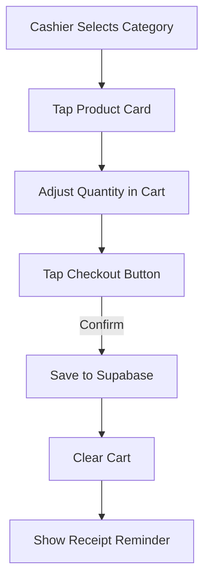
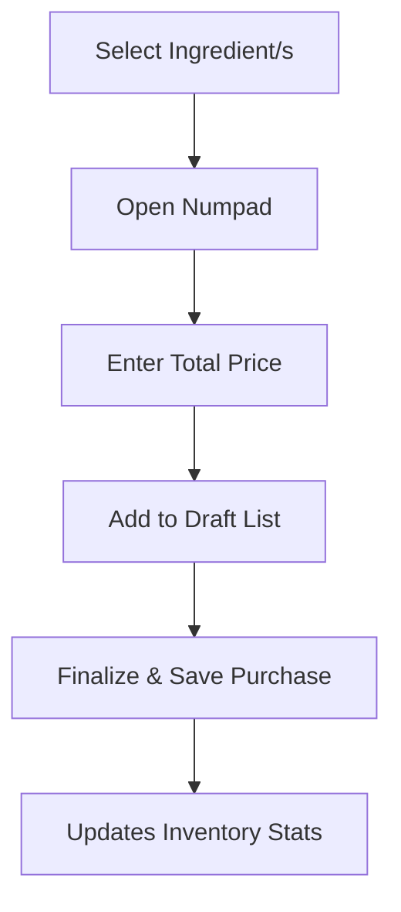

# Think Corner Cafe POS - Master Documentation

This document serves as the **Single Source of Truth** for the Think Corner Cafe POS system. It combines architectural overviews, detailed page guides, technical specifications, and financial calculation logic.

---

## 🏛️ System Architecture

### Frontend Stack
- **Core:** React 18 + Vite (TypeScript)
- **State Management:** Zustand (for persistent POS cart and global settings)
- **Styling:** Tailwind CSS (Custom "Stone" aesthetic)
- **Icons:** Lucide React
- **Charts:** Recharts
- **Drag & Drop:** @dnd-kit (for product sorting)
- **Date Handling:** date-fns
- **Excel Export:** xlsx

### Backend / Infrastructure
- **Database:** Supabase (PostgreSQL)
- **Authentication:** Supabase Auth (Email/Password)
- **Persistence:** LocalStorage (for Stock-In drafts and store state)

---

## 🎨 Design Philosophy & Optimization

### The "Stone" Aesthetic
The system uses a premium "Stone" design system, characterized by:
- **Palette:** HSL-tailored shades of stone (stone-50 to stone-950).
- **Typography:** Bold hierarchy with `font-black` headings and `font-bold` primary labels.
- **Micro-interactions:** Subtle hover states and active button scales (95%) for tactile feedback.
- **Componentry:** Rounded-2xl and rounded-3xl containers for a modern, approachable feel.

### Optimized for Low-End Hardware
The application is specially optimized for **low-end ARM-based tablets** (Android/iOS):
- **No Heavy Animations:** CSS transitions and `framer-motion` are avoided to maintain 60fps on limited CPU/GPU.
- **Memoization:** Extensive use of `React.memo`, `useMemo`, and `useCallback` to prevent unnecessary re-renders in complex lists (POS cart, Reports grid).
- **Virtualized feel:** Efficient handling of 2+ years of historical data through aggressive filtering and asynchronous library loading (e.g., Excel engine).

---

## 📖 Module-by-Module Guide

### 1. Point of Sale (POS) Page
**Route:** `/pos` | **File:** `src/pages/POSPage.tsx`

The primary sales interface for cashiers.
- **Product Catalog:** Responsive grid (2-4 columns) with category filtering.
- **Cart Management:** Real-time quantity steppers and unit price breakdowns.
- **Confirmation UX:** Two-step checkout to prevent accidental sales.
- **Receipt Reminder:** A 3-second non-blocking overlay to remind staff to provide a bill.

### 2. Stock-In Page (Inventory Entry)
**Route:** `/stock-in` | **File:** `src/pages/StockInPage.tsx`

Logs all incoming inventory and purchases.
- **Dual-Mode Entry:**
  - **Ingredient Mode:** Select from master ingredients list. Handles single or multiple ingredients.
  - **Manual Mode:** For ad-hoc supplies not in the database.
- **Tablet Input Suite:** 
  - **Numpad Modal:** Large touch controls for price/quantity.
  - **Georgian Keyboard:** Custom on-screen keyboard for naming manual items.
- **Simplified Bulk Entry:** When multiple ingredients are selected, the total price is automatically divided equally among them to speed up entry.
- **Draft Persistence:** Unsaved progress is automatically cached in `localStorage` (`stock-in-draft`).

### 3. Admin Panel
**Route:** `/admin` | **Access:** Admin role only.

#### Dashboard
Real-time KPI grid (Total Revenue, Orders, Average Check, Total Expenses) and a dynamic revenue bar chart with period filtering (7d, Weekly, Monthly).

#### Product Management
Full CRUD for menu items. Features **Optimistic UI Drag-and-Drop reordering** using `@dnd-kit`, persisting position via a `sort_order` field.

#### Expense Management
Categorized overhead tracking (კომუნალურები, ინგრედიენტები, მომსახურება, მასალები, სხვა). Includes advanced date range filtering to manage historical logs efficiently.

#### Advanced Reporting
- **Revenue vs. Expenses:** Comparative bar charts.
- **Profit Trends:** Blue-gradient line charts showing net margins over time.
- **Data Forensic Tables:** Detailed logs for products, ingredients, and expenses.
- **Multi-Sheet Export:** Generates professional `.xlsx` files with separate sheets for each reporting category.

---

## 📉 Financial & Calculation Logic

This section defines how the core metrics are calculated within the `ReportsPage.tsx` and `DashboardPage.tsx`.

### 1. Gross Revenue
$$Total Sales = \sum (Quantity \times Sale Price)$$
Calculated by summing all `total` values from the `orders` table.

### 2. Cost of Goods Sold (COGS)
$$COGS = \sum (Quantity \times Last Purchase Cost)$$
Determined by joining `order_items` with the **most recent** `purchase` record for each ingredient. *Note: The system uses the "Latest Cost" method rather than FIFO/LIFO to reflect current market prices in profit estimates.*

### 3. Net Internal Profit (Formula A)
$$Net Profit = Gross Revenue - COGS - General Expenses$$
This provides the actual "take-home" profit after all overhead (bills, maintenance, ad-hoc costs) is deducted.

### 4. Markup Margin (Formula B)
$$Margin \% = \frac{Sale Price - COGS}{Sale Price} \times 100$$
Used in product performance tables to identify high-efficiency items versus volume-movers.

---

## 🔄 User Flow Diagrams

### Sales Workflow

### Stock-In Workflow

---

## 💾 Database Schema

### `products`
| Column | Type | Description |
|---|---|---|
| id | uuid | Primary Key |
| name | text | Localized name |
| price | numeric | Sale price |
| category | text | Filter label |
| sort_order | int | Drag-and-drop position |

### `purchases`
| Column | Type | Description |
|---|---|---|
| id | uuid | Primary Key |
| ingredient_id | uuid? | Linked ingredient |
| quantity | numeric | Volume purchased |
| total | numeric | Total GEL spent |
| date | timestamp | Entry time |

---

## 🛠️ Maintenance & Deployment

### Scalability
The system is designed to handle thousands of records. Historical filtering (e.g., "This Month") ensures the UI remains responsive by reducing the size of the DOM and the Recharts data array.

### Data Simulation
The `simulateData.ts` utility (located in `src/utils`) allows developers to seed the database with 2 years of randomized realistic data for stress-testing and demonstration purposes.
